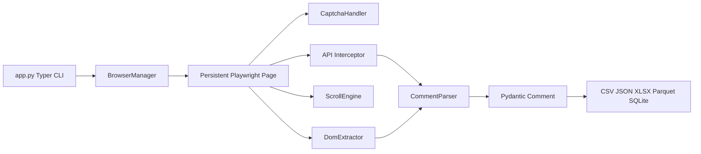
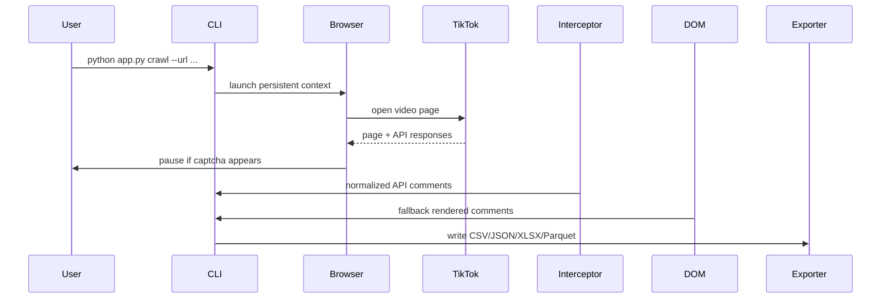

# TikTok Social Listening Framework

Async Playwright crawler for collecting TikTok comments for marketing analytics, classroom demos, and future sentiment-analysis pipelines.

This refactor replaces the original single-file crawler with a modular framework. It keeps the practical classroom features: persistent browser sessions, manual captcha solving, reply crawling, tolerant selector fallbacks, debug screenshots, and spreadsheet-friendly exports.

## Quick Start

```powershell
python -m venv .venv
.\.venv\Scripts\Activate.ps1
python -m pip install --upgrade pip
pip install -r requirements.txt
python -m playwright install chromium
copy .env.example .env
```

Run one video crawl:

```powershell
python app.py crawl --url "https://www.tiktok.com/@ai.agent.vn/video/7598434143021698322?q=social%20media%20marketing&t=1778866382108" --max-comments 200
```

Search and crawl top videos:

```powershell
python app.py search --keyword "skincare" --top-n 10 --max-comments-per-video 500
```

Convert a JSON export to Parquet:

```powershell
python app.py export --input-json output/post_1234567890.json --format parquet
```

## Persistent Profiles (Reuse)

To avoid repeated logins, create and reuse a persistent Playwright profile directory.

- Login once and save the profile (open a visible browser, authenticate manually):

```powershell
python app.py crawl --url "https://www.tiktok.com/" --profile-dir profiles/default --wait-login-seconds 300 --keep-open
```

After you sign in, close the browser (or stop the run) so cookies and localStorage are persisted in `profiles/default`.

- Reuse the saved profile for subsequent crawls or searches:

```powershell
python app.py crawl --url "https://www.tiktok.com/@creator/video/12345" --profile-dir profiles/default

python app.py search --keyword "skincare" --top-n 10 --profile-dir profiles/default
```

Notes:
- Use a visible browser when logging in manually (omit `--headless`).
- Keep profiles private — they contain authenticated session data.
- If you want to reset, delete the profile folder: `rm -r profiles/default`.


## Architecture Overview





## Project Structure

```text
app.py
config/           settings and constants
browser/          Playwright lifecycle, persistent sessions, stealth, captcha
crawler/          TikTok crawler, scrolling, DOM extraction, API interception, parsing
models/           Pydantic Comment, VideoTarget, CrawlResult
storage/          CSV, JSON, XLSX, Parquet, SQLite writers
analytics/        beginner-friendly text cleaning and sentiment helpers
notebooks/        classroom walkthrough
tests/            parser, storage, and helper tests
output/           generated exports and debug artifacts
profiles/         persistent browser sessions
```

## Captcha Workflow

TikTok may show a verification screen. The crawler detects common captcha text, iframes, and SecSDK containers, then pauses:

```text
Please solve TikTok verification manually in the opened browser.
The crawler will resume automatically after verification disappears.
```

Use visible browser mode for classroom runs. The default profile folder is `profiles/default`, so cookies and logins can persist between sessions.

If TikTok asks you to log in, use the opened browser window to authenticate manually. The crawler will wait until login completes and then resume crawling.

## Anti-Bot Limitations

This tool does not bypass TikTok security. It uses Playwright, persistent sessions, human-in-the-loop verification, and conservative waits. TikTok may still rate-limit, block, hide comments, or change API/DOM structures. When a run returns zero comments, debug HTML and screenshots are saved in `output/debug`.

## Export Formats

The crawler can write:

- CSV for Excel and Google Sheets
- JSON for reproducible pipelines
- XLSX for non-technical classroom users
- Parquet for analytics workflows
- SQLite for future database exercises

## Ethical Scraping

Use this framework for teaching, research, and analytics with care. Collect only data you are allowed to process, avoid excessive crawling, respect platform terms, anonymize where appropriate, and do not use the data to target or harm individual users.

## Troubleshooting

- Browser does not open: run `python -m playwright install chromium`.
- Captcha never clears: solve it in the visible browser and increase `--captcha-timeout`.
- Zero comments: try `--max-scrolls 80`, verify the comments tab is visible, and inspect `output/debug`.
- Parquet export fails: ensure `pyarrow` is installed.
- TikTok search is unstable: use direct video URLs for the most reliable classroom exercise.

## Roadmap

- Add richer Thai sentiment models.
- Add topic modeling and dashboard notebooks.
- Add account/video metadata collectors.
- Add rate-limit policies for institutional labs.
- Add optional database append mode for longitudinal projects.

