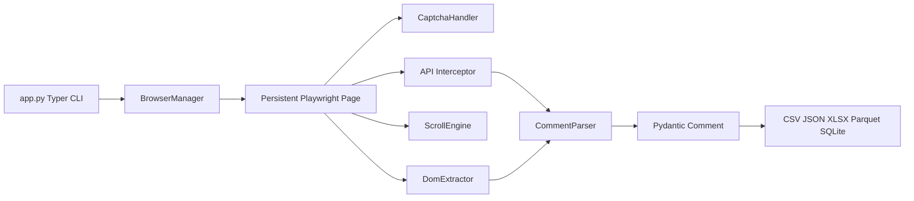
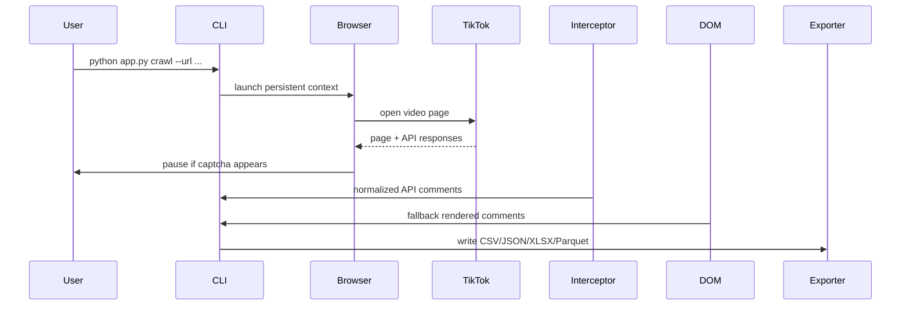

# TikTok Social Listening Framework

Async Playwright crawler for collecting TikTok comments for marketing analytics.

This project focuses on developing an automated data collection tool designed to extract customer comments data from specific posts (or a curated list of posts) on Tiktok. The primary objective is to gather a rich, real-world dataset to support practical assignments and research in the Social Media Analytics course.

## Quick Start

```powershell
python -m venv .venv
.\.venv\Scripts\activate
python -m pip install --upgrade pip
pip install -r requirements.txt
python -m playwright install chromium
copy .env.example .env
```

Run one video crawl:

```powershell
python app.py crawl --url "https://www.tiktok.com/@rioolite6969/video/7613919533417418002" --max-comments 100
```

Run batch crawl from a URL list:

```powershell
python app.py batch-crawl --urls-file data/urls.txt --max-comments 100 --output-dir output
```

```powershell
python app.py search --keyword "Tensei shitara Slime Datta Ken" --top-n 10 --max-comments-per-video 100
```

Convert a JSON export to Parquet:

```powershell
python app.py export --input-json output/post_7613919533417418002.json --format parquet
```

## Notes on Login and Profiles

TikTok's login flow is frequently blocked for automated browser sessions. This repository no longer relies on persistent profile directories or manual login workflows.

- Use direct video URLs or search-based crawling for the most reliable results.
- The crawler still supports visible mode and local Chrome/Edge selection for better compatibility.
- Do not expect authenticated sessions to persist across runs.


## Architecture Overview





## Project Structure

```text
app.py
config/           settings and constants
browser/          Playwright lifecycle, browser lifecycle, stealth, captcha
crawler/          TikTok crawler, scrolling, DOM extraction, API interception, parsing
models/           Pydantic Comment, VideoTarget, CrawlResult
storage/          CSV, JSON, XLSX, Parquet, SQLite writers
analytics/        beginner-friendly text cleaning and sentiment helpers
notebooks/        classroom walkthrough
tests/            parser, storage, and helper tests
output/           generated exports and debug artifacts
profiles/         legacy session data or manual browser traces
```

## Captcha Workflow

TikTok may show a verification screen. The crawler detects common captcha text, iframes, and SecSDK containers, then pauses:

```text
Please solve TikTok verification manually in the opened browser.
The crawler will resume automatically after verification disappears.
```

Use visible browser mode for classroom runs. The crawler is designed for anonymous comment collection and does not depend on persistent authenticated sessions.

If TikTok shows a login dialog, the crawler will attempt to dismiss it and continue. For the most reliable results, use direct video URLs instead of relying on a logged-in homepage session.

## Anti-Bot Limitations

This tool does not bypass TikTok security. It uses Playwright, browser stealth techniques, human-in-the-loop verification, and conservative waits. TikTok may still rate-limit, block, hide comments, or change API/DOM structures. When a run returns zero comments, debug HTML and screenshots are saved in `output/debug`.

## Export Formats

The crawler can write:

- CSV for Excel and Google Sheets
- JSON for reproducible pipelines
- XLSX for non-technical classroom users
- Parquet for analytics workflows
- SQLite for future database exercises

## Ethical Scraping

Use this framework for teaching, research, and analytics with care. Collect only data you are allowed to process, avoid excessive crawling, respect platform terms, anonymize where appropriate, and do not use the data to target or harm individual users.

## Troubleshooting

- Browser does not open: run `python -m playwright install chromium`.
- TikTok blocks login on the bundled Chromium: run with `--browser-channel chrome` or `--chrome-path "C:\Program Files\Google\Chrome\Application\chrome.exe"`.
- Captcha never clears: solve it in the visible browser and increase `--captcha-timeout`.
- Zero comments: try `--max-scrolls 80`, verify the comments tab is visible, and inspect `output/debug`.
- Parquet export fails: ensure `pyarrow` is installed.
- TikTok search is unstable: use direct video URLs for the most reliable classroom exercise.

## Roadmap

- Add richer Thai sentiment models.
- Add topic modeling and dashboard notebooks.
- Add account/video metadata collectors.
- Add rate-limit policies for institutional labs.
- Add optional database append mode for longitudinal projects.

